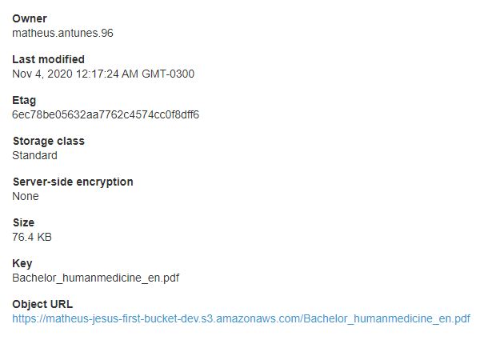
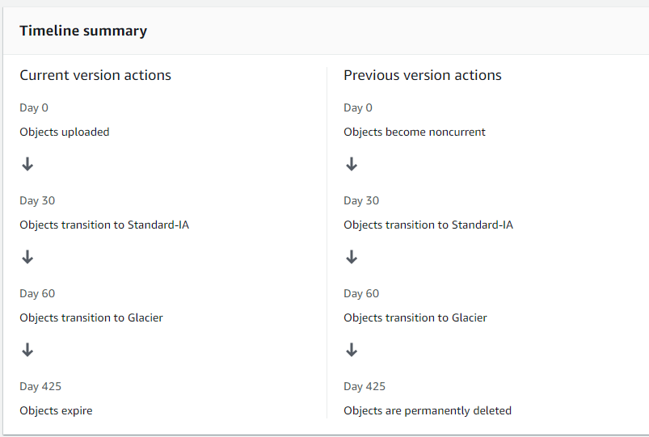

# S3 by Ryan Kroonenburg

## S3 101

Simple Storage Service 

It is a **Universal Namespace**. Names must be unique **globally**

Provides developers and IT teams with **secure, durable, highly scalable** object storage.
Amazon **S3** is easy to use, with a simple web services interface to store and retrieve any amount of data from anywhere on the web.

*S3 is a safe place to store files*

* Object based storage
* Data is spread accorss multiple devices and multiple facilities

### Files

* Can be from 0 Bytes to 5 TB
* Unlimited Storage
* Files are stored in Buckets (*Folder*)

Names must be unique globally because it generates URLs to access

**S3** Endpoint `https://acloudguru.us-east-1.amazonaws.com`

* Successful upload -> HTTP Status Code **200**
  
#### Attributes

* Key (Name of the object)
* Value (Data bytes)
* VersionID (*Important for versioning*)
* Metadata (data about data stored)
* Subresources
    * Access Control Lists
    * Torrent

### Data Consistency

* **Read after Write** consistency for **PUTS** of new Objects
* **Eventual Consistency** for **overwrite** PUTS and DELETES (can take some time to propagate)

#### Guarantees

* Build for **99.99%** availability for the S3 platform
* Amazon Guarantee **99.9%** availability
* Amazon guarantees **99.999999999%** durability for S3 information (11x 9s)

### Features

* Tiered Storage Available
* Lifecycle Management (move objects to different storage tiers by date rules)
* Versioning
* Encryption
* MFA Delete
* Secure data with **Access Control Lists** and **Bucket Policies**
  
### S3 Storage Classes

#### S3 Standard

* **99.9%** availability
* **99.999999999%** durability
* Stored **redundantly** across **multiple devices** in multiple facilities, and is designed to **sustain the loss of 2 facilities concurrently**.

#### S3 - Infrequently Accessed

For data that is accessed less frequently, but requires **RAPID** access when needed.

**LOWER** fee than S3 **Standard**, but charges **RETRIEVAL FEE**.

#### S3 One Zone - Infrequently Accessed

**LOWER** cost option for **infrequently accessed** data, but do **NOT** require the **multiple Availability Zone** data resilience.

* Uses only one availability zone

#### S3 - Intelligent Tiering

Designed to optimize costs by automatically moving data to the most cost-effective access tier, without performance impact or operational overhead

#### S3 - Glacier

Secure, durable and low-cost storage class for **data archiving**.

Store any amount of data at costs that are competitive with or chearper than on-premises solutions.

**Retrieval times configurable from minutes to hours**

#### S3 - Glacier Deep Archive

S3's **LOWEST COST** storage class where a retrieval time of **12 hours** is **acceptable**

**S3 Summary**

### Pricing

* Charged in terms of storate
* Requests
* Store Management Pricing
* Data Transfer Pricing
* Transfer Acceleration
    * **Fast, easy and secure transfers** of files over **long distances** between end **users** and **S3 bucket**
    *  Users Amazon **CloudFront**'s globally distributed **EDGE LOCATIONS**
    *  As data arrives to edge location, it is then **routed** to **S3** over **optimized** **network** (Backbone network) path
* Cross Region Replication *Automatic replication amongst regions*
    * Reasons may be high availability or disaster recovery 

### Lesson Outputs

* S3 is OBJECT-BASED
* Files can be from 0 Bytes to 5 TB
* Unlimited storage
* Files are stored in Buckets
* S3 is a universal namespace (bucket name must be unique globally)
    * Creates DNS name
* **NOT SUITABLE TO INSTALL AN OPERATING SYSTEM ON**
    * ONLY STORE FILES
* Success Uploads responds HTTP Status Code **200**
* **MFA Delete** is available to **protect objects**
* Objects are *Key, Value, VersionID, Metadata, ACL, Torrent*
* Consistency Models (Read after Write on New Objects / Eventual Consistency on **OVERWRITE PUTS** and **DELETES**)
* Classes
    * S3 Standard ( 4x 9s availability and 11x 9s durability )
    * S3 IA - Infrequent Access (charges retrieval fee)
    * S3 One Zone - IA [OR ARS]
    * S3 Intelligent Tiering (Machine Learning)
    * S3 Glacier (Archiving minutes to hours retrieval)
    * S3 Glacier Deep Archiving (Hours to retrieval)

[**READ S3 FAQ**](https://aws.amazon.com/pt/s3/faqs/)

## S3 Demo

* Access S3
* Note it is a Global region
* Choose unique bucket name
* Region
* Block all public access (default **all blocked**)
* Bucket Versioning
* Encryption
* Object lock
* Create Bucket

### Upload files

* Open Bucket
* Upload Files
* Click on a file for more information

**Trying to access OBJECT URL will respond AccessDenied**

### Public Access

In order to make files publicly available, the **Bucket** must also be publicly available.

Alter Permission -> Public Access

**Trying to access OBJECT URL will still respond AccessDenied**

Open object information and **MAKE PUBLIC**

Now the URL responds the object

### Storage Class for an individual Object

Alter Storage class

### Bucket modification

#### Permissions

* Block Public Access -> Flags to allow object to be public or private
* Access Control Lists -> Fine Grained AC to the object level
* Bucket Policy -> Policies up to the bucket level
* CORS Configuration -> Front-End

#### Management

* Lifecycle Rules
* Replication

### Lesson Outputs

Control access to bucket using either a **Bucket ACL** or using **Bucket Policies**

## S3 Pricing Tiers

Which tier should you use in a given scenario

Costs:

* Storage (GB)
* Requests and Data Retrievals
* Data Transfer
* Management and Replication

Focus is Storage Tiers

- Standard *Most Expensive*
    - $0.023 per GB on first 50TB/Month
    - $0.022 per GB on next 450TB/Month
    - $0.021 over 500TB/Month
- IA
    - $0.0125 per GB/Month
- One Zone IA *If Region fails, may lose data*
    - $0.01 per GB/Month 
- Intelligent Tiering *Takes advantage of the Infrequent Access*
    - Same as standard for frequent access 
    - $0.0125 per GB on infrequent access
- Glacier
  -  $0.004 per GB/Month 
- Glacier Deep Archive
    - $0.00099 per GB/Month

*Understand how to get the best value out of s3*

**Try to avoid S3 Standard -> Use Intelligent Tiering to move to IA when needed**

**Archival services should always be on Glacier**

## S3 Security & Encryption

### The Basics

By default, all newly created buckets are **PRIVATE**

* Bucket Policies (Bucket Level)
* Access Control Lists (Object Level)

*S3 Buckets can be configured to create access logs which log all requests made to the S3 Bucket -> Can be logged to another Bucket or AWS Account*

### Encryption In Transit

* HTTPS (Encrypted traffic)
* SSL / TLS

### Encryption At Rest (Server Side)

*Encrypt data being stored*

* S3 Managed Keys - SSE-S3
* AWS Key Management Services (KMS) - SSE-KMS
* Server Side Encryption With Customer Provided Keys - SSE-C

*Client Side Encryption can be done by uploading a previously encrypted object*

**Encryption can be configured on object or bucket level**

## S3 Versioning-LAB

Stores all versions of an object (including all writes even if you delete an object).

**Great Backupt tool**

* Once enabled, **Versioning** **cannot** **be** **disabled**, **only** **suspended**
* Integrates with **Lifecycle** rules -> *Move to different Tier*
* Versionin's **MFA Delete** capability, which uses multi-factor authentication, can be used to provide an additional layer of security

* Update bucket properties 
    * Enable Object Versioning

* Upload a txt file `Hello`
* Make it public
* Alter the txt file to `Hello V2`
* Make it **public again**
* Delete the latest version *Notice s3 versions it as Delete Marker, but all previous version are still available*
* Deleting the Delete Marker will restore to latest version
* Delete certain version (Not latest)

* *Stores all version of an object (including all writes and delete)*
* *Great Backup Tool*
* *Once enabled, Versioning cannot be disabled, only suspended*
* *Integrates with lifecycle rules*
* *Versioning has MFA Delete capability*

## Lifecycle Management with S3

Bucket management -> Lifecycle rules

It transfers objects to a different S3 Tier based on a rule

Create Lifecycle rule

* Pick a name
* Filter (with tags) to only take effect at a certain type of object (or whole bucket)
* Actions
    * Current Version transition (*Picked*)
    * Previous Version transition (*Picked*)
    * Expire current version (*Picked*)
    * Perma Delete previous versions (*Picked*)
    * Delete expired delete markers or Delete incomplete multipart uploads
* Pick transitions for each Action
    * Standard to IA after 30 days
    * IA to Glacier after 60 days
    * Expire current versions of objects after 425 days
    * Permanently delete previous versions of objects after 425 days
    * Delete incomplete multipart uploads after 7 days

    

*Move around tiers and delete stuff*

*Automates moving your objects between storage tiers*

*Can be used in conjunction with versioning (to deal with previous versions and current versions)*

## S3 Object Lock & Glacier Vault Lock

Use it to store objects as **Write ONCE read MANY**

*Prevents modification or deletion of object*

*Meet regulatory requirements that require WORM storage or extra layer of protection*

### Governance Mode

Users **can't overwrite or delete an object** version or alter its lock settings.

*Unless they have a special permission*.

### Compliance Mode

A protected object version **can't be overwritten** or deleted by **ANY USER**

*Ensures the retention period from overwrites or deletions*

### Legal Holds

Prevents an object version from being overwritten or deleted.

**A Legal Hold does not have an associated retention period. It remaisn in effect until removed**

### Glacier Vault Lock

Easily deploy and enforce compliance controls for individual S3 Glacier vaults with a Vault Lock Policy

*WORM -> Write Once Read Many*

*Object locks can be on objects or bucket*

*Two Modes -> Governance (special user may alter) and Compliance (nobody can alter until retention period is over)*

*S3 Glacier Vault Lock -> Use Vault Lock Policy to enforce compliance controls (Can do WORM). Once locked it can no longer be chanded*

## S3 Performance

### S3 Prefix

`bucket/folder1/sub1/object.jpg` > /folder1/sub1 is a prefix

**S3 has extremely low latency. First byte delivery within 100-200ms**

* Achieve 3500 **PUT/COPY/POST/DELETE** requests per second per prefix
* Achieve 5500 **GET/HEAD** requests per second per prefix

*Get better performance by using different prefixes*

#### Limitations

* If using SSE-KMS, keep in mind **KMS Limits**
  * When uploading a file, **GenerateDataKey** in KMS API
  * When downloading a file, **Decrypt** in KMS API
  * Quotas depends on the region
    * either 5500; 10000; 30000 requests per second 
    * **THERE ARE NO QUOTA INCREASES FOR KSM**

### S3 Multipart Uploads

Recommended for files over **100MB**
**Required** for files over **5GB**

Parallelize Uploads (increases efficiency)
* Breaks file into parts to upload to s3 concurrently

### S3 Byte-Range Fetches

Parallelize downloads by specifying byte ranges
* If there is a failure in the download, it's only for a specific byte range

*Prefixes are the pathway between object and bucket -> The more the better*
* 3500 PUTs and related
* 5500 Gets and related

*SSE-KMS will count toward KMS quota*

*Multi part upload for files over 100MBs*

*S3 Byte Range when downloading large files*

## S3 Select & Glacier Select

### S3 Select

Enables applications to retrieve only a subset of data from an object by using **SQL Expression**

Using S3 SELECT may increase performance **by up to 400%** and up to **80% Cheaper**

Use Case:

* A Zipped CSV file might have to be fetched, uncompressed and queried

* S3 Select -> Simple query gets the specific part of csv file

### Glacier Select

Highly regulated industries write data directly to Amazon Glacier to satisfy compliance needs like **SEC Rule 17a-4**.

*Glacier Select allows you to run SQL queries against Glacier directly*

## Sharing S3 Buckets Across Accounts

### Using Bucket Policies & IAM (applies across the entire bucket)

Programmatic Access Only (**No Console**)

### Using Bucket ACLs & IAM (Individual Objects)

Programmatic Access Only (**No Console**)

### Cross-account IAM Roles

Programmatic and Console Access!!!!!!!!

* Copy Account B ID
* IAM -> Create Role
* Another AWS Account
    * Set Account ID
    * Give it Policies (S3 Full Access Only)
    * Name it S3 Cross Account
    * Get URL to **Switch ROLE**

* Log in Account B
* Create User -> Create Group
* Log in with IAM
* Switch role to S3 Cross Account Role
    * It has permissions to S3 ONLY

## Cross Region Replication

Bucket -> Management -> Replication

**Requires Versioning**

* Pick a Name for replication
* A Role (Create New)
* A Destination Bucket (Must have versioning)
* *Possible to change S3 Tier on replication*

**Does not replicate current objects, only new uploads**

**Delete Marker is not Replicated**

**Delete the Version does not replicate**

*Versioning MUST be enabled in both source and destination*

*Files in existing bucket are not replicated*

*Subsequent updates will be replicated*

*Delete markers or versions will NOT be replicated*

## S3 Transfer Acceleration

Utilises the CloudFront Edge Network to accelerate your uploads to S3.

**Instead** of uploading directly to S3, use a **distinct URL** to upload directly to an **EDGE LOCATION** which will then transfer that file to S3

*acloudguru.s3-accelerator.amazonaws.com*

Uploads to EDGE Location first, anywhere in the world

[Comparer S3 - Transfer Acceleration with Edge Location](http://s3-accelerate-speedtest.s3-accelerate.amazonaws.com/en/accelerate-speed-comparsion.html)

## AWS DataSync

Allows to move large amounts of data into AWS.

Typically on-premise. Install DataSync Agent on a server that connects to NAS or File System.
Copy Data from and to AWS.

Automatic Encryption and optimization for better traffic

Seamlessly connected to S3, Elastic File System and FSx for Windows File Server

* *A way of synching large amounts of data to and from AWS*
* *Used with NFS and SMB compatible file systems*
* *Replication can be done hourly, daily or weekly*
* *Install the DataSync agent to start replication*
* *Can be used to replicate EFS -> EFS*
