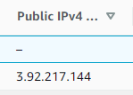

# AWS VPCs by Mark Richman

## VPC Overview

Virtual data center in the cloud

Virtual Private Cloud lets privision a **logically** isolated section of the AWS Cloud where you can launch AWS resources in a virtual network. You have complete control over virtual networking environment, including selection of IP address range, creation of subnets and configuration of route tables and network gateways.

Customize network configuration for VPC.

Subnets for public and private pieces of the system

Leverage Multiple layers of security including:
* Security Groups
* Network Access Control Lists

*Can extend corporate datacenter with VPC connected to on-prem network*

Inside a region:

**Public Subnet**

`Internet Gateway -> Route Table -> Network ACL -> Public Subnet -> Security Group -> Instance`

**Private Subnet**

`Virtual Private Gateway -> Route Table -> Network ACL -> Private Subnet -> Security Group -> Instance` 

**1 Subnet = 1 AZ**

**Corporate Subnets are usually 10.0.X.0/16 (Largest subnet /16 in VPC)**

### Features

* Launch instances into a subnet
* Assign custom IP address ranges in each subnet
* Route tables between subnets
* Internet gateway and attach to VPC
* Security control
* Instance security groups
* Subnet netwoek access control lists (ACLs)

### Default VPC vs Custom VPC

* Default VPC is user friendly, allowing to immediately deploy instances.
* All subnets have a route out to the internet
* Each EC2 instance has both a public and a private IP address

### VPC Peering

* Allows to connect one VPC with another via a direct network route using private IP addresses.
* Instances behave as if they were on the same private network
* Peer VPC's with other AWS accounts or same account
* Peering is in a STAR CONFIGURATION. 1 Central VPC peers with 4 others **NO TRASNSITIVE PEERING** `Peering is 1 to 1, there is no way to go across a peer to access another VPC`
* Peer across REGIONS

## Create Own Custom VPC

* Your VPCs
* Create VPC
  * IPv4 CIDR Block (10.0.0.0/16) 
  * Tenancy (Default -> Share underlying hardware with other AWS customers)
  * *Route Table is automatically created*
  * *Network ACL is automatically created*
  * *Security Group is automatically created*
* Create Subnets
  * Name Subnet (10.0.1.0 - us-east-1a cloudguru) 
  * Pick VPC (cloudguru)
  * Pick AZ 
  * IPv4 CIDR block (10.0.1.0/24)
  * *Auto-assign public IPv4 is default to **NO***
  * *AWS Reserves 5 IP addresses*
    * *Network Address*
    * *Router Address*
    * *DNS Server Address*
    * *One more for future use*
    * *Broadcast Address* 
  * Modify Auto-assign public IPv4 to YES
* Create Internet Gateway
  * Pick name (IGW cloud guru)
  * Attach to VPC
  * *Only One ATTACH per VPC*
* DO NOT Alter Route Table
  * *Always keep MAIN ROUTE TABLE PRIVATE*  
  * Have a separate route table for public access
* Create Route Table for Public Access
  * Edit ROUTE
    * Add Route
      * Destination: 0.0.0.0/0
      * Target: Internet Gateway (IGW cloud guru)   
  * **ANY SUBNET ASSOCIATED WITH THIS ROUTE TABLE WILL BECOME PUBLIC**
  * Associate Subnet (10.0.1.0 - us-east-1a cloudguru)
    * *It is now dissociated from MAIN ROUTE TABLE* 
* Create EC2 Instance
  * Set VPC and Public Subnet 
  * Set VPC and Private Subnet

  

* Private instances should have its own Security Group
  * Inbound Rules
    * HTTP Allow another security group or allow **IP range** (10.0.1.0/24)
* Actions -> Security -> Change Security Group of the Private subnet instance
### Examp Tips

* *When creating a VPC from scratch, a default route table, network ACL and default security group are created*
* *NO SUBNETS OR INTERNET GATEWAYS ARE CREATED BY DEFAULT*
* *AZ names are randomized*
* *Amazon Reserves 5 IP addresses within subnets*
* *Only 1 Internet Gateway per VPC*
* *Security Groups Can't Span VPCs*

## NAT Instances & NAT Gateways

Network Address Translation

Enable Private subnet instances to download software on internet

### NAT Instances

Single EC2 instances

*Legacy*

* Create EC2 Instance
  * Community AMI for NAT
  * Public subnet
  * Must disable Source/Destination checks (acts like a gateway to internet gateway)
* Update MAIN ROUTE TABLE
  * Set Destination 0.0.0.0/0 -> Target NAT instance
* Call update on Private instance after SSH from Public instance

*Single Virtual Machine that can get easily overwhelmed -> Single point of failure*

### NAT Gateway

Highly available gateway that allows private instances to access the internet without being public

Create NAT Gateway -> Pick a subnet
* Update MAIN ROUTE TABLE
  * Destination 0.0.0.0/0 -> Target NAT Gateway 

* *Redundant inside AZ*
* *Preferred by the enterprise*
* *From 5 to 45 Gbps*
* *No need to patch O.S.*
* *Not associated with security groups*
* *Automatically assigned a public ip address*
* *Update MAIN ROOT TABLE*

**If you have resources in multiple AZs sharing one NAT Gateway, if the NAT Gateway AZ is down, resources in other AZ lose internet access**

*Prevent it by creating a NAT Gateway per AZ*

## Network Access Control Lists vs Security Groups

* Access VPC
  * Network ACLs
  * Associated to a VPC
  * *It has inbound rules*
  * Create New Network ACLs
    * Pick VPC (cloud guru)
    * It defaults to **DENY** everything 
    * Associate **subnet** to ACL
  * Edit Inbound Rules
    * Rule **100** Allow HTTP (80)
    * Rule **200** Allow SSH (22)
    * Rule **300** **DENY** HTTP (80) *It does not have any effect because there is an ALLOW before - **REMOVE AFTER***
    * Rule **400** Allow **1024-65535** *For NATS Gateway*
  * Edit Outbound Rules
    * Rule **100** Allow HTTP (80)
    * Rule **200** Allow SSH (22)
    * Rule **300** Allow **1024-65535** *Ephemeral Ports - Short-lived transport protocol*

### Exam Tips

* *A default Network ACL is created when VPC is created*
* *All following subnets are automatically associated to the default NACL*
* *Create a new NACL to a VPC and associate subnets*
* *Rule changes take effect immediately*
* *Rules are evaluated in order of Rule Number*
* *NACLs are evaluated before Security Groups*
  * *Denying in NACL, it won't reach the SG* 

## Custom VPCs and ELBs - LAB

*Privisoning ELB requires at least 2 public subnets*

## VPC Flow Logs - Demo

Enables to capture information about the IP traffic going to and from network interfaces in VPC.

Flow log data is stored in **CloudWatch Logs**

3 Different levels:
* VPC
* Subnet
* Network Interface Level (ENI)

Access VPC
* Select VPC -> Actions -> Create Flow Log
  * Filter (Log accepted / rejected traffic or **all**)
  * Destination (CloudWatch Logs or S3)
  * Destination log group (Defined in CloudWatch *Access CloudWatch -> Logs -> Create Log Group*)
  * IAM Role (*Create New IAM Role*)

* *Can't enable flow logs for peered VPCs across accounts*
* *Allowed to TAG flow logs*
* *Can't alter IAM Role*
* *Not ALL IP Traffic is monitored*
  * *Traffic generated by instances when they contact the Amazon DNS server **UNLESS YOU USE YOUR OWN DNS SERVER*** 
  * *Traffic generated by a Windows instance for Amazon Windows license activation*
  * *Traffic to and from 169.254.169.254 for instance meta-data*
  * *DHCP traffic*
  * *Traffic to reserver IP addresses*

## Bastion Hosts

Special purpose computer on a network specifically designed and configured to withstand attacks.

The computer generally hosts a single application, i.e. a proxy server, and all other services are removed or limited to reduce the threat to the computer.

Located outside of firewall or in a demilitarized zone (Public Subnet)

*Forwards SSH or RDP to private instances*

Not like NAT Gateway/Instance
* These are used to provide internet traffic to EC2 instance in private subnet

Bastion
* Used to securely administer EC2 instances (SSH or RDP)
**NAT Gateway can't be used as a Bastion Host**

## Direct Connect

Establish a dedicated network connection from your premises to AWS. Private connectivity between AWS and premises datacenter, office or environment.

Reduce network costs, increase bandwidth throughput, and provide a more consistent network experience.

`AWS Region -> VPC -> AWS Cage with DX Router -> Direct Connect Location -> Customer Routers -> Customer LAN`

**It does not use Internet**

* *Directly connects data center to AWS*
* *Useful for high throughput workloads*
* *Stable and reliable secure connection*

### Creating Direct Connect

* Access Direct Connect
  * Create a virtual interface **Start with PUBLIC Virtual Interface**
* Access VPC
  * Create a Customer Gateway
  * Create a Virtual Private Gateway   
  * Attach the Virtual Private Gateway to the VPC
* Select VPN Connections
  * Create a New VPN Connection
  * Select the Virtual Private Gateway and the Customer Gateway
* Once the VPN is available, set up the VPN on the customer gateway or firewall

[Youtube Ref](https://www.youtube.com/watch?v=dhpTTT6V1So)

## Global Accelerator

Create Accelerators to improve availability and performance of applications for local and global users.

Directs traffic to optimal endpoints over the AWS global network

*By default, it provides 2 static IPs associated with the accelerator*

`USER -> Edge Location -> Global Accelerator -> Endpoint Group -> Endpoints`

### Components

* Static IP Addresses
  * 2 provided 
* Accelerator
  * Directs traffic to optimal endpoints over the AWS global network 
* DNS Name
  * Assigns a default DNS Name that points to the static IP addresses 
* Network Zone
  *  Similar to an AZ, it is an Isolated Unit with its own set of physical infra
* Listener
  * Processes inbound connections from the clients based on the port and protocol configured 
* Endpoint Group
  * Associated to an AWS Region
  * Include one or more endpoint in the Region
  * Increase or reduce percentage of traffic directed to an endpoint group by adjusting **traffic dial** 
* Endpoint
  * NLB, ALB, EC2 Instance....
  * Can be internet-facing or internal
  *  Traffic is routed to endpoints based on configuration options *such as weights*

### Demo

* Create an Endpoint (EC2 instance)
* Access Global Accelerator
* Create Accelerator
  * Pick Name (cloudguru)
  * IP address type (IPV4)
  * Configure Listeners
    * Ports 80 and 443 with TCP
  * Configure Endpoint Groups
    * Pick region and Traffic Dial (us-east-1, 100)
  * Configure Endpoints
    * EC2 instance (pick resource) and weight (**from 0 to 255**)

### Exam Tips

* *Create Accelerators to improve availability and performance of applications*
* *Always assinged two static IPs*
* *Control traffic using **Traffic Dials** in endpoint group configuration*
* *Control application traffic with weights on endpoints configuration*

## VPC Endpoints

Enables to privately connect VPC to supported AWS services and VPC endpoint services powered by **PrivateLink** without requiring **internet gateway, NAT, VPN connection or Direct Connect**

**Instead of using Internet Access to communicate with AWS resources, use VPC Endpoints to access through AWS private network**

Two types of VPC endpoints
* Interface Endpoints
  * Elastic network interface with a private IP that server as an entry point for traffic destined to a supported service. 
* Gateway Endpoints
  * S3, DynamoDB currently 

### Create

* VPC Dashboard
* Access Endpoints
* Create Endpoint
  * Service Category (AWS Services)
    * Pick S3 Gateway
    * Pick VPC (cloudguru)
    * Pick Route Table (main)
    * Policy (full access)  

## AWS Private Link

Open VPC connections to other VPCs in a private AWS network

* *Best way to expose a service VPC to thousands of customer VPCs*
* *No VPC Peering, No route tables, no NAT, no IGW, etc..*
* **Requires a Network Load Balancer on the service VPC and an Elastic Network Interface on the customer VPC**

## AWS Transit Gateway

Simplifies Network Topology

* *Allows trasitive peering between thousands of VPCs and on-premises data centers*
* *Works on HUB-AND-SPOKE model*
* *Regional bases but can have it across multiple regions*
* *Use it across multiple AWS accounts using RAM (Resource Access Manager)*
* *Use Route tables to limit how VPCs talk to each other*
* *Works with **Direct Connect** and **VPN***
* *Supports IP **Multicast***

## AWS VPN Cloud Hub

Connect to VPC by VPN connections

* *Multiple sites, each with its own VPN connection, use VPN CloudHub to connect those sites together*
* *HUB-AND-SPOKE model*
* *Low cost; easy to manage*
* *Operates over public internet with encrypted traffic*

## AWS Network Costs

Cost optimization for VPC architecture

`USER -> VPC`

* *Incoming traffic from user is **FREE***
* *Service Instance communicating with DB Instance over private IP in the same AZ is **FREE***
  * *Another AZ will **CHARGE** (on private or public IP) (private is cheaper)* 
* *VPC A and B in different regions **CHARGE***

* **Private IP addresses over public**
* **Group EC2 instances in the same AZ and use private IPs (single point of failure)**

## VPC Summary

* VPC is a logical datacenter
* Consists of Internet Gateways (or Virtual Private Gateways), Route Tables, Network ACLs, Subnets, Security Groups
* 1 Subnet = 1 AZ
* Security groups are **STATEFUL**; NACLs are **STATELESS**
* No Transitive Peering
* VPC from scratch creates a default route table, NACLs and SG
  * No subnet, IGW
* Amazon reserver 5 IPs per subnet
* 1 Internet Gateway per VPC
* Security Groups can't span VPCs
* NAT Instance
  * Disable Source/Destination Check on EC2 instance
  * Public subnet ONLY
  * Configure VPC main route table to route 0.0.0.0/0 to NAT instance
  * Increase instance size if bottleneck
  * Can create high availability with autoscaling gorup, multiple subnets in different azs
  * Needs a security group
* NAT Gateways
  * Redundant inside the AZ
  * Preffered
  * From 5 to 45 Gbps
  * No Patching
  * No SG
  * Automatic IP address
  * Still need to update main route table to route 0.0.0.0/0 to NAT Gateway
  * Do not share NAT Gateway for instances in another AZ. Create a NAT Gateway in each AZ
* Network ACL
  * VPC comes with a default (with all inbound and outbound traffic ALLOWED)
  * New NACLs by default DENIES all traffic
  * Associate subnet in VPC with the NACLs (a subnet can only be associated with 1 NACL)
  * Block Specific IPs (Rules are evaluated in order of Rule#)
  * Separate inbound and outbound traffic rules
* ELB's
  * Minimum of 2 public subnets to deploy
* VPC Flow Logs
  * Not allowed in VPC Peering with another account
  * Tag Flow Log
  * No changing IAM Role
  * Not ALL IP traffic is monitored (internal instances calling dns, windows instance, 169.254.169.254, DHCP traffic, AWS reserved IPs)
  * 3 Levels (VPC, Subnet and ENI) 
* Bastion
  * Administer (SSH or RDP) to a private subnet instance
* Direct Connect
  * Connects data center to AWS
  * High throughput
  * Secure and stable connection
* Global Accelerator
  * Create accelerator for improving availability and performance of apps
  * `USER -> Edge Location -> Global Accelerator -> Endpoint Group -> Endpoints`
  * Two static IPs assinged
  * Control traffic using **traffic dials** on endpoint group configuration
  * Control weighting to individual endpoints using weights on endpoints configuration
* VPC Endpoint
  * Privately connect VPC to AWS Services
  * 2 Types (Interface *many services*, Gateway *s3, dynamoDb*)
* AWS Private Link
  * Peering VPCs to thousands of customer VPCs
  * Requires Network Load Balancer on Service VPC and ENI on Customer VPC
* Transit Gateway
  * Simplifies network topology
  * HUB AND SPOKE model
  * Transitive peering between thousands of VPCs and on-premises
  * Cross accounts
  * Multiple regions or single
  * Supports **IP Multicast**
* VPN CloudHub
  * Simplifies VPN Connections
  * Connect enterprise sites with VPN (public internet but encrypted)
  * Low cost; easy manage
  * HUB AND SPOKE model
* Network Cost
  * Use private IPs over public
  * Group EC2 instances in the same AZ with private IPs (single point of failure)

**Build everything from memory before exam**
