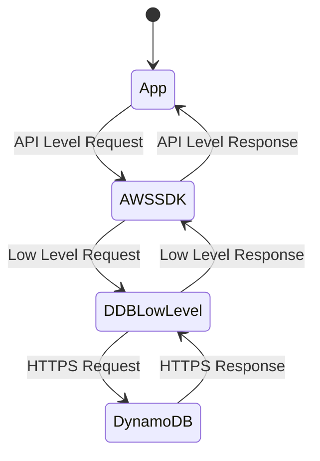

# Accessing DynamoDB by Mark Richman

## Console configuration

* Table Names
* Primary Key (Partition Key can only be of number, string or binary)
* Provisioned capacity mode
    * Provisioned
    * On-demand 
* Secondary indexes
    * Local (Same Partition Key but different Sort Key) **MUST BE CREATED ON CREATION TIME**
    * Global 
* Provisioned capacity
    * Define RCU and WCU
* Scaling
    * Max RCU and MCU 
* Encryption
    * Default or KMS

**Tables are specified per Region but Global Tables can be set up for multiregion replication**

## AWS CLI

Creating own access keys

Go to IAM
Create Access Key
* Access Key ID
* Secret Access Key

```sh
aws configure
# insert access key id
# insert secret access key
aws sts get-caller-identity
# returns the account
aws dynamodb help
# get help
aws dynamodb create-table help
# get create-table help
```

### Create DynamoDB Table on Shell

```sh
aws dynamodb create-table \
--table-name Music \
--key-schema AttributeName=Artist,KeyType=HASH \
             AttributeName=SongTitle,KeyType=RANGE \
--attribute-definitions \
             AttributeName=Artist,AttributeType=S \
             AttributeName=SongTitle,AttributeType=S \
--provisioned-throughput \
             ReadCapacityUnits=5,WriteCapacityUnits=5

aws dynamodb describe-table --table-name Music
# Definition of table
```

### Put Item

```sh
aws dynamodb put-item \
    --table-name Music \
    --item '{
        "Artist": { "S": "Dream" },
        "AlbumTitle": { "S": "Images and Words" },
        "SongTitle": { "S": "Undler a Glass Moon" },
    }'

aws dynamodb scan --table-name Music
# Scan for all data
```

## SDK Options



### HTTPS DynamoDB

Headers

* X-Amz-Target: Action
* Authorization: Credentials
* Data Type description
* x-amzn-RequestId: Generated by Amazon
* Data: All data from the Item
* Date: Timestamp

### DocumentClient

High level API for CRUD

### DynamoDB Local

Downloadable dynamodb for local development

```sh
aws dynamodb create-table \
--table-name Music \
--key-schema AttributeName=Artist,KeyType=HASH \
             AttributeName=SongTitle,KeyType=RANGE \
--attribute-definitions \
             AttributeName=Artist,AttributeType=S \
             AttributeName=SongTitle,AttributeType=S \
--provisioned-throughput \
             ReadCapacityUnits=5,WriteCapacityUnits=5
--endpoint-url http://localhost:8000

aws dynamodb describe-table --table-name Music --endpoint-url http://localhost:8000
# Definition of table
```

**Docker Image**

[REF](https://hub.docker.com/r/amazon/dynamodb-local/)
```sh
docker run -d -p 8000:8000 amazon/dynamodb-local
```
